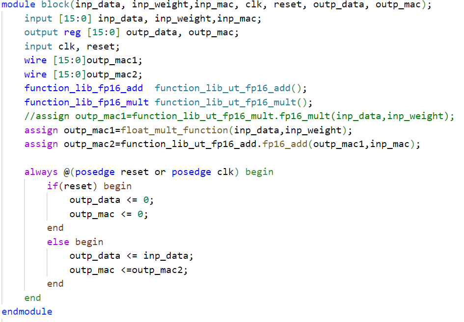
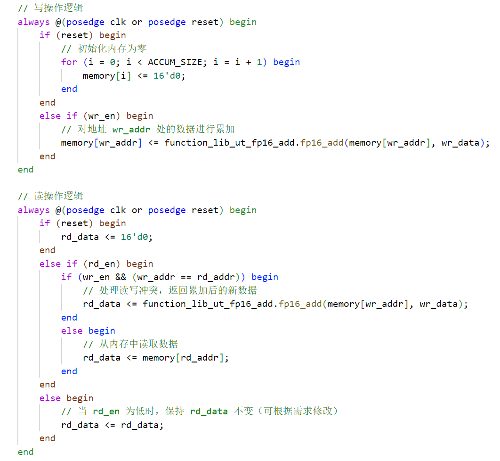
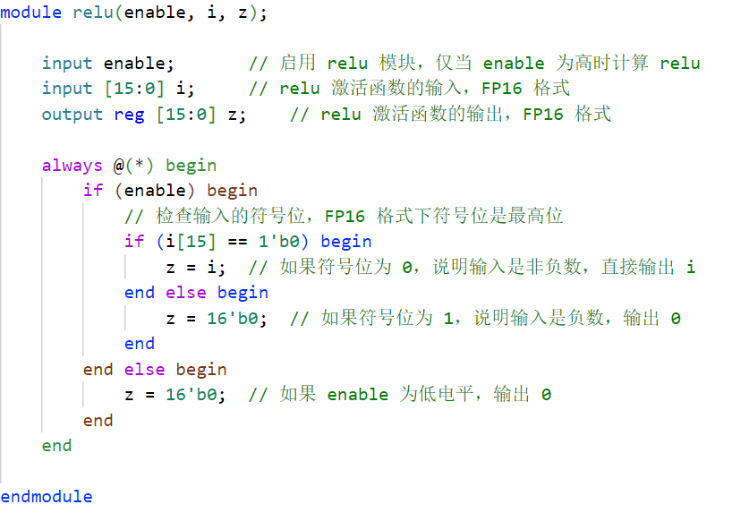
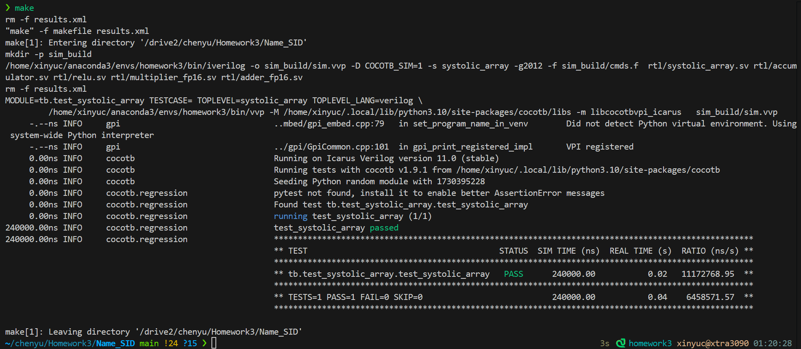
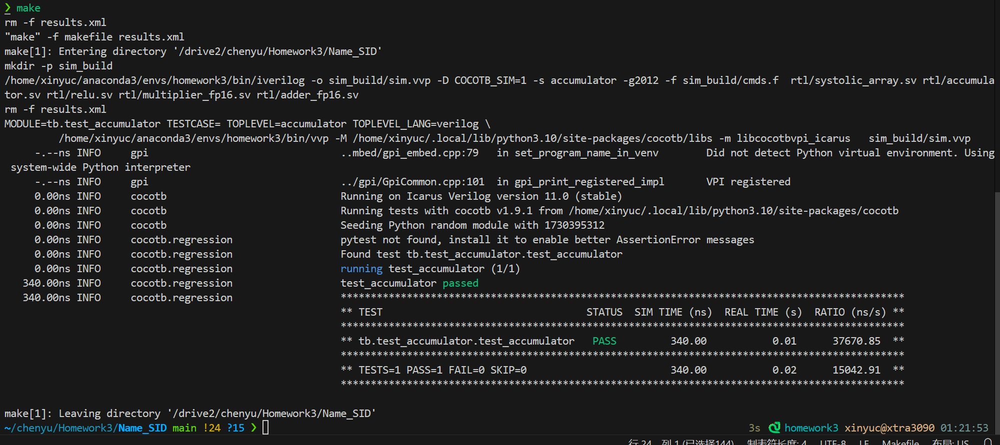
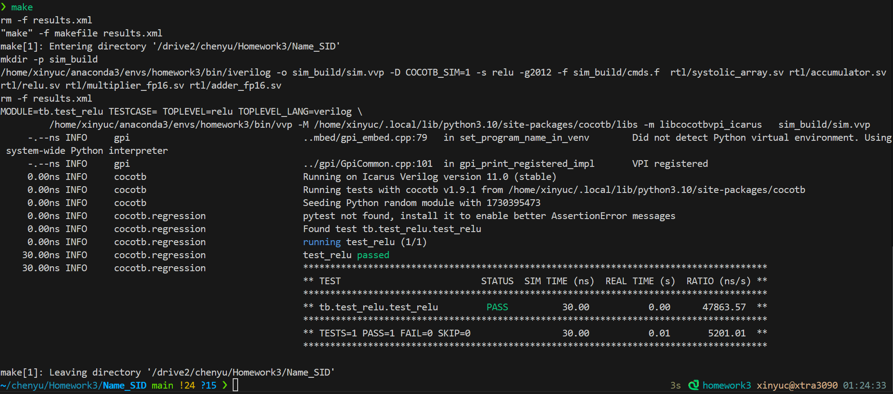

# Report of HW3


[TOC]

## Implementation

I designed three major modules: Systolic Array, Accumulator, and ReLU. Among them, Systolic Array consists of 64 PE units. Each PE unit calls the fp16 adder and multiplier previously built based on gate circuits; Accumulator calls the previously built fp16 adder based on gate circuits; ReLU does not call other sub-modules. At the same time, there are two sub-folders under the RTL folder: adder_fp16 and multiplier_fp16. These two folders contain sub-modules of multipliers and adders based on gate circuits.

### Systolic Array

Each Systolic Array consists of 64 PE units, and each PE unit is designed according to the structure taught in the course. There are three inputs, namely numerical value, weight, and numerical value * weight accumulated from the PE unit above. Each PE unit has outputs in two directions. The output in the left direction directly outputs the value on the right. The output in the lower direction is the current value multiplied by the weight and then added to the accumulated value of the upper PE unit. The PE unit calls the previously designed multipliers and adders

### Accumulator
The design architecture of the accumulator is relatively simple. Based on the dual-port ram, it adds the function of accumulating the written data at the same address when the written addresses are the same.

### ReLU
The design architecture of the activation layer is also relatively simple. It determines whether the input is a positive or negative number by judging the sign bit. When the input is a positive number, it remains unchanged, and when it is a negative number, it is 0.

## Usage

(Since we need to test your design, please tell us how we test your design, such as the content Makefile)

```
  create a conda environment
  conda create n -homework2
  conda activate homework2
  conda install cocotb
  conda install -c conda-forge iverilog

# If you want to test systolic array design, 
# please uncomment the following two lines in makefile
 TOPLEVEL = systolic_array
 MODULE = tb.test_systolic_array

# If you want to test accumulator design, 
# please uncomment the following two lines in makefile
 TOPLEVEL = accumulator
 MODULE = tb.test_accumulator

# If you want to test relu design, 
# please uncomment the following two lines in makefile
 TOPLEVEL = relu
 MODULE = tb.test_relu

 notice
 be sure to remember to make clean before different test

```

## Result

(Please paste the terminal result of the testbench we provided here)

**Systolic Array**



**Accumulator**



**ReLU**


